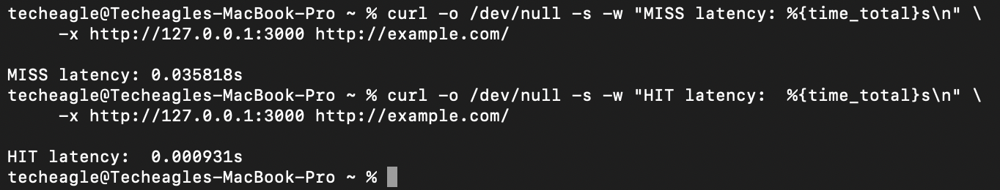
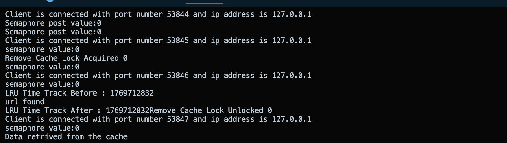

# Multithreaded HTTP Proxy Server with LRU Cache (C)

This project is a multithreaded HTTP proxy server written in **C using POSIX APIs**.  
It handles multiple client connections concurrently and improves response time by caching server responses using an **in-memory LRU cache**.

The project focuses on **low-level systems programming concepts** such as TCP sockets, thread synchronization, bounded buffers, and cache management — similar to how real-world proxy servers work internally.

---

## What this project does

- Accepts multiple client connections over TCP
- Uses a **thread pool** to handle concurrent requests
- Implements a **bounded request queue** using semaphores
- Forwards HTTP requests to the target server on cache miss
- Stores responses in a shared **LRU cache**
- Serves cached responses directly on cache hit
- Ensures thread safety using mutexes and semaphores

---

## Why this project

Most backend systems hide concurrency behind frameworks.  
This project intentionally avoids abstractions and works directly with:

- sockets
- pthreads
- semaphores
- mutexes

It helped me understand how concurrency, synchronization, and caching affect **performance and correctness** in real servers.

---

## High-level architecture

                           ┌───────────────────────────────┐
                           │          Clients              │
                           │  Client 1 | Client 2 | ... N  │
                           └───────────────┬───────────────┘
                                           │
                                           │ TCP Connections
                                           ▼
                   ┌────────────────────────────────────────────┐
                   │     Server Listener (Main Thread)           │
                   │  socket() | bind() | listen() | accept()    │
                   └────────────────────────┬───────────────────┘
                                            │
                                            │ Enqueue Request
                                            ▼
          ┌──────────────────────────────────────────────────────────┐
          │                    Request Queue                          │
          │                  (Bounded Buffer)                         │
          │                                                          │
          │  pthread_mutex_t queue_mutex                              │
          │  sem_t empty  → available slots                           │
          │  sem_t full   → queued requests                           │
          └────────────────────────┬─────────────────────────────────┘
                                   │
                                   │ Dequeue Request
                                   ▼
        ┌─────────────────────────────────────────────────────────────┐
        │                     Thread Pool                              │
        │                                                             │
        │   ┌──────────────┐   ┌──────────────┐   ┌──────────────┐   │
        │   │ Worker T1    │   │ Worker T2    │   │ Worker TN    │   │
        │   └──────┬──────┘   └──────┬──────┘   └──────┬──────┘   │
        │          │                 │                 │          │
        └──────────┼─────────────────┼─────────────────┼──────────┘
                   │                 │                 │
                   │ Cache Lookup    │ Cache Lookup    │ Cache Lookup
                   ▼                 ▼                 ▼
        ┌─────────────────────────────────────────────────────────────┐
        │                 Shared In-Memory Cache                       │
        │               (Hash Map / LRU Cache)                          │
        │                                                             │
        │        pthread_mutex_t cache_lock                             │
        └─────────────────────────────────────────────────────────────┘
                   │
                   │ Build Response
                   ▼
           ┌──────────────────────────────────────┐
           │         TCP Socket Write              │
           └────────────────────┬─────────────────┘
                                │
                                ▼
                          Back to Clients

---

## Request handling flow

1. A client connects to the proxy server.
2. The main server thread accepts the connection.
3. The request is placed into a bounded request queue.
4. A worker thread dequeues the request.
5. The worker checks the shared cache:
   - If the response exists, it is returned immediately.
   - If not, the request is forwarded to the remote server.
6. The response is stored in the cache using an LRU policy.
7. The response is sent back to the client.
8. The worker thread exits and releases resources.

---

## Concurrency model

The server follows the **Producer–Consumer pattern**.

- **Producer**: Main server thread (accepts connections)
- **Consumers**: Worker threads in the thread pool

### Synchronization primitives

- `pthread_mutex_t`  
  Protects shared data structures like the request queue and cache.

- `sem_t empty`  
  Tracks available slots in the request queue.

- `sem_t full`  
  Tracks the number of pending requests.

This design prevents:
- race conditions
- busy waiting
- unbounded thread creation

---

## Why data is handled in chunks

HTTP responses are received over TCP, which is a **stream-based protocol**.  
There is no guarantee that the entire response will arrive in a single read.

Reading data in chunks:
- Ensures correctness for partial reads
- Avoids large memory allocations
- Supports responses of unknown or large size
- Allows streaming data directly to the client

This is how real proxy servers forward data efficiently.

---

## Cache design (LRU)

- The cache is shared across all worker threads.
- Each entry maps a request URL to its response.
- On every cache hit, the access time is updated.
- When the cache reaches capacity, the **least recently used** entry is evicted.
- All cache operations are protected using a mutex.

This significantly reduces response time for repeated requests.

---

## Performance results

### Cache latency comparison

 
